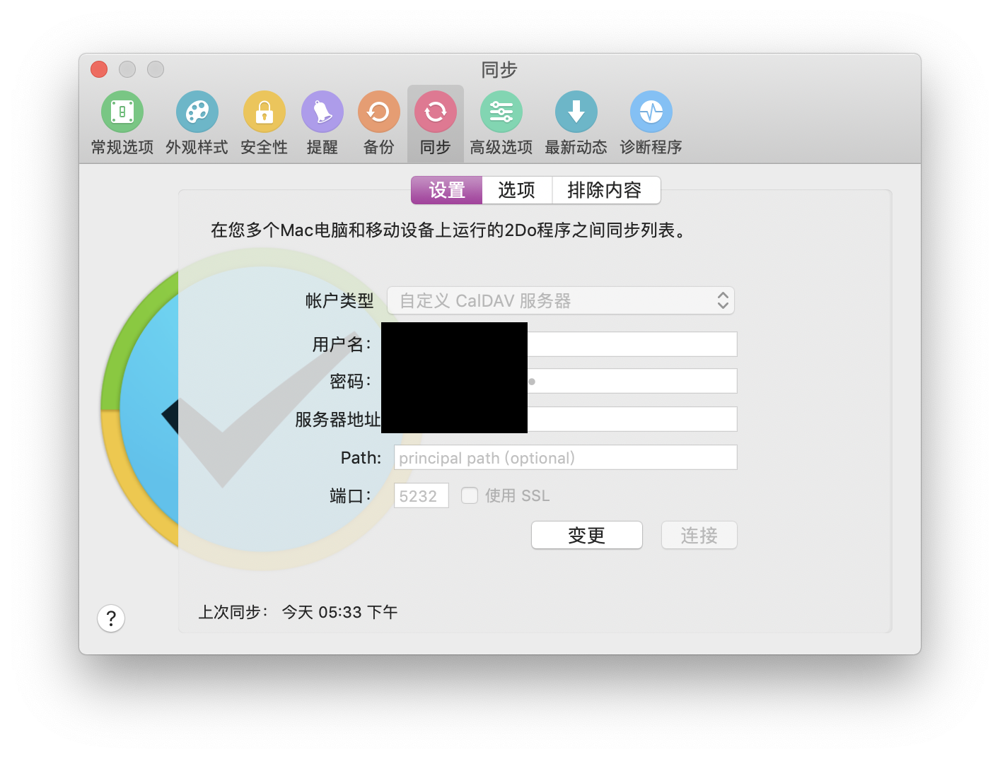

## 用阿里云服务器自己搭建2do同步caldav服务器
一个月前，把任务管理从Microsoft TO-DO迁移到2Do中，自己手上常用一台小米9和Macbook Pro，同步成了问题，不能使用icloud remainder。那就只有DropBox等服务可用。
因为Dropbox在国内不稳定的连接以及近阶段自己手上的梯子挂掉了，所以琢磨自己搭一个同步使用的服务器。
流程非常简单。一个小时以内就可办完。
使用到的:
1. 阿里云ECS低配版，如果使用学生版一个月9.5元。
2. python3。
3. radicale，使用python3编写的caldav服务器程序。

### 步骤一览: 
1. 云服务器购买与登录
2. 安全组设置
3. Python3环境
4. 安装radicale
5. 配置radicale

---

### 云服务器准备

购买与登录的流程就自己搜索吧。我购买的是Ubunt的主机，也可以使用CentOS。

需要注意的是在创建服务器实例之前，最好先将本机的ssh public key导入到阿里云中，并且新建实例后选择该public key，不然不能够在终端中登录，而阿里云提供的浏览器vnc完全不能用。也可以在创建实例后再创建public key，只是需要重启实例罢了。

### 安全组设置

阿里云默认关闭大多数端口，包括了我们这次要使用到的5232端口。所以请自行搜索“阿里云 安全组 端口开启“完成该步骤。


### Python3的环境搭建

这一步大体上也是请搜索“Ubuntu python3“

需要注意的是先使用`sudo apt-get update`更新本地软件目录。


### 安装radicale

这一步会很详细的讲。

安装radicale

```
python3 -m pip install --upgrade radicale 
```
若是在本地使用，可以使用下面这个命令。

```shell
python3 -m radicale --config "" --storage-filesystem-folder=~/.var/lib/radicale/collections
```

然后访问 http://localhost:5232

但是若在服务器上访问就无法访问。需要配置参数。

我使用的配置有，把配置文件放在`/etc/radicale/config`

```
[server]
# Bind all addresses
hosts = 0.0.0.0:5232
daemon = True
[auth]
type = htpasswd
htpasswd_filename = /etc/radicale/users
htpasswd_encryption = plain
[storage]
filesystem_folder = ~/.var/lib/radicale/collections
```

想详细了解更多配置选项可以查看[configuration](https://radicale.org/configuration/)

然后可以设置用户名和密码, 把配置文件放在`/etc/radicale/users`

```
user:password
```

然后启动就好了。

```
python3 -m radicale
```

正常访问。

然后在2Do的配置上选择就好了。

